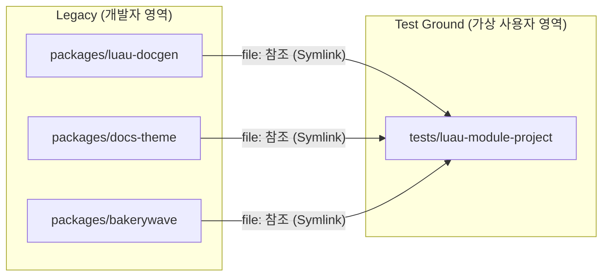

# 로컬 테스트 환경 가이드 (Local Testing Environment Guide)

이 문서는 Bakerywave를 개발하면서 **로컬 환경에서 변경 사항을 검증하고 테스트하는 방법**을 아주 상세하게 다룹니다.
단순히 "어떤 명령어를 치면 된다"를 넘어서, **왜 그렇게 동작하는지(원리)**와 **문제가 생겼을 때 어떻게 해결하는지(디버깅)**까지 꼼꼼하게 설명합니다.

---

## 🏗️ 1. 테스트 환경의 동작 원리 (Architecture)

Bakerywave는 다른 사람들이 자신의 프로젝트에 설치해서 사용하는 **"라이브러리(Library)"**이자 **"도구(Tool)"**입니다.
따라서 우리가 개발을 할 때는, **"마치 사용자가 된 것처럼"** 행동해서 도구가 잘 작동하는지 확인해야 합니다.

이를 위해 우리는 프로젝트 내부에 **가짜 사용자 프로젝트(Virtual User Project)**를 만들어 두었습니다.

### 1.1 구조도



### 1.2 핵심 원리: 심볼릭 링크 (Symlink)

보통 사용자는 `npm install @storybakery/bakerywave`를 통해 npm 저장소에 있는 코드를 다운로드합니다.
하지만 개발 중인 우리는 **내 컴퓨터에 있는 수정된 코드**가 즉시 반영되길 원합니다.

이를 위해 `tests/luau-module-project/website/package.json` 파일을 보면, 의존성이 다음과 같이 설정되어 있습니다:

```json
"dependencies": {
  "@storybakery/bakerywave": "file:../../../packages/bakerywave",
  "@storybakery/docs-theme": "file:../../../packages/docs-theme",
  ...
}
```

이 `file:` 프로토콜 덕분에, 여러분이 `packages/` 폴더 안의 코드를 수정하고 저장하면, **즉시 테스트 프로젝트에도 반영**됩니다(일부 빌드 과정 필요). 이것이 로컬 테스트의 핵심 원리입니다.

### 1.3 팀 개발 표준

Bakerywave는 로컬 개발 시 **`file:` 의존성 기반 연동**을 표준으로 사용합니다.

- 목적: 배포/태그 없이 로컬 수정 내용을 즉시 검증하기 위함
- 범위: `tests/luau-module-project/website`와 외부 연동용 로컬 프로젝트
- 참고: `file:` 방식은 npm 표준 기능입니다.

### 1.4 `file:` 연동 실제 설정 방법

아래 절차를 그대로 따라 하면 `file:` 기반 개발 환경을 바로 구성할 수 있습니다.

#### A. 이 저장소 내부 테스트 프로젝트에서 사용

이 저장소는 이미 `tests/luau-module-project/website/package.json`에 `file:` 의존성이 설정되어 있습니다.
따라서 보통은 설치만 다시 하면 됩니다.

```bash
# 프로젝트 루트에서 실행
npm install
npm --prefix tests/luau-module-project/website install
```

이후 `packages/`의 코드를 수정하고 아래 명령으로 확인합니다.

```bash
npm run dev:test
```

#### B. 외부 프로젝트에서 로컬 Bakerywave를 연결해서 사용

1. 외부 프로젝트의 `package.json` `dependencies`를 `file:`로 설정합니다.
2. `npm install`을 실행합니다.
3. `npm exec bakerywave -- ...` 또는 프로젝트 스크립트로 CLI를 실행합니다.

예시:

```json
"dependencies": {
  "@storybakery/bakerywave": "file:../bakerywave/packages/bakerywave",
  "@storybakery/docs-preset": "file:../bakerywave/packages/docs-preset",
  "@storybakery/docs-theme": "file:../bakerywave/packages/docs-theme",
  "@storybakery/docusaurus-plugin-reference": "file:../bakerywave/packages/docusaurus-plugin-reference",
  "@storybakery/docusaurus-plugin-search-index": "file:../bakerywave/packages/docusaurus-plugin-search-index",
  "@storybakery/luau-docgen": "file:../bakerywave/packages/luau-docgen"
}
```

```bash
# 외부 프로젝트 루트에서 실행
npm install
npm exec bakerywave -- dev --site-dir .
```

참고:
- 경로(`file:../bakerywave/...`)는 실제 디렉토리 구조에 맞게 조정해야 합니다.
- `bakerywave`만 연결하지 말고 관련 `@storybakery/*` 패키지를 함께 맞추는 것을 권장합니다.
- 외부 프로젝트에서는 `file:` 변경을 로컬 개발용으로만 사용하고, 공용 브랜치에 `package.json`/`package-lock.json` 변경을 커밋하지 않는 것을 권장합니다.

더 자세한 디렉토리 구조 설명은 **[구조 및 픽스처(Fixture)](./fixture.md)** 문서에서 확인할 수 있습니다.

---

## 📂 2. 테스트 프로젝트 디렉토리 분석

테스트의 무대가 되는 `tests/luau-module-project` 폴더의 역할을 하나하나 뜯어봅시다.

| 경로              | 역할 및 설명                                                                                                                                     |
| :---------------- | :----------------------------------------------------------------------------------------------------------------------------------------------- |
| `src/`            | **가짜 Luau 소스 코드**입니다. 실제 사용자가 작성할 법한 `.luau` 파일들이 들어있습니다. 파서(Parser)가 잘 작동하는지 테스트하기 위한 재료입니다. |
| `website/`        | **가짜 문서 사이트**입니다. Docusaurus로 만들어져 있습니다. 여기서 실제 문서가 생성되고 웹사이트가 뜹니다.                                       |
| `bakerywave.toml` | **설정 파일**입니다. Bakerywave가 어떻게 동작해야 하는지(어떤 파일을 읽고 어디에 문서를 내보낼지) 정의합니다.                                    |
| `website/.generated/`     | **중간 산출물**입니다. `luau-docgen`이 코드를 분석한 결과(`luau.json`) 등이 이곳에 저장됩니다.                                            |

---

## 🚀 3. 테스트 실행 가이드 (Step-by-Step)

아무것도 모르는 상태에서 테스트를 시작하는 과정을 순서대로 따라 해봅시다.

### 단계 1: 의존성 설치 (최초 1회)

프로젝트 루트에서 다음 명령어를 실행하여, 테스트 프로젝트가 로컬 패키지들을 연결하도록 합니다.
이 과정은 한 번만 수행하면 되지만, `package.json`이 변경되었다면 다시 실행해야 합니다.

```bash
# 프로젝트 루트(bakerywave/)에서 실행
npm install
npm --prefix tests/luau-module-project/website install
```

### 단계 2: 데이터 생성 (Reference Build)

Bakerywave의 핵심 기능인 "Luau 코드 분석"을 테스트합니다.
이 과정은 **Luau 소스 코드(`src/`)**를 읽어서 **중간 데이터(`json`)**를 만들고, 최종적으로 **문서 파일(`mdx`)**을 생성합니다.

```bash
npm --prefix tests/luau-module-project/website run reference:build
```

**✅ 확인 포인트:**
1. 명령어가 에러 없이 끝났는가?
2. `tests/luau-module-project/website/docs/reference/luau` 폴더 안에 `.mdx` 파일들이 생성되었는가?
3. `tests/luau-module-project/website/.generated/reference/luau.json` 파일이 갱신되었는가?

### 단계 3: 개발 서버 실행 (Dev Server)

생성된 문서가 웹 브라우저에서 어떻게 보이는지 확인합니다.

```bash
npm --prefix tests/luau-module-project/website run dev
# 또는 루트 단축 스크립트
# npm run dev:test
```

터미널에 `http://localhost:3000` 주소가 뜨면 접속해보세요.

---

## 🔧 4. 개발 시나리오별 테스트 방법

여러분이 **무엇을 수정했느냐**에 따라 테스트 방법이 달라집니다.

### 시나리오 A: "Rust 파서(`packages/luau-docgen`)를 수정했어요"

가장 까다로운 경우입니다. 소스 코드를 수정하고 컴파일까지 해야 합니다.

1. **Rust/C++ 코드 수정**: `packages/luau-docgen/native/src/...` 또는 `packages/luau-docgen/native/cpp/src/...` 파일을 수정합니다.
2. **바이너리 빌드**: Rust 코드는 컴파일되어야 실행 가능합니다.
   ```bash
   # packages/luau-docgen 폴더에서
   npm run native:build
   # 또는 packages/luau-docgen/native 폴더에서
   # cargo build --release
   ```
3. **참조 데이터 재생성**:
   ```bash
   npm --prefix tests/luau-module-project/website run reference:build
   ```
4. **결과 확인**: 생성된 `.mdx` 파일이나 웹사이트에서 변경 사항을 확인합니다.

### 시나리오 B: "문서 생성 로직(`packages/docusaurus-plugin-reference`)을 수정했어요"

분석된 데이터(`json`)를 가지고 Markdown(`mdx`)을 만드는 로직을 수정한 경우입니다.

1. **JavaScript 코드 수정**: 플러그인 코드를 수정합니다 (`packages/docusaurus-plugin-reference/generate.js`, `packages/docusaurus-plugin-reference/index.js`).
2. **참조 데이터 재생성**: 플러그인을 다시 실행시켜야 합니다.
   ```bash
   npm --prefix tests/luau-module-project/website run reference:build
   ```

### 시나리오 C: "테마(`packages/docs-theme`)나 UI를 수정했어요"

React 컴포넌트나 CSS를 수정한 경우입니다.

1. **코드 수정**: React 컴포넌트를 수정합니다.
2. **확인**: `npm --prefix tests/luau-module-project/website run dev`가 켜져 있다면, 변경을 감지해 자동으로 재생성/재시작됩니다.
3. **주의**: 반영이 안 된다면 터미널 로그에서 재생성 에러를 확인하고 개발 서버를 다시 실행하세요.

---

## ❓ 5. 자주 묻는 질문 (Troubleshooting)

### Q. 소스 코드를 바꿨는데 문서가 안 바뀌어요!
**A.** `npm --prefix tests/luau-module-project/website run dev`를 사용하면 `reference watch`가 함께 실행되어 변경 시 자동 재생성됩니다.
그래도 반영되지 않으면 터미널 로그에 에러가 없는지 확인하고, 아래 명령어로 수동 재생성을 실행하세요.
```bash
npm --prefix tests/luau-module-project/website run reference:build
```

### Q. "Module not found" 같은 에러가 나요.
**A.** `npm install`이 꼬였을 수 있습니다.
테스트 사이트 의존성을 초기화한 뒤 다시 설치해보세요.
```bash
# 테스트 사이트 의존성 초기화
rm -rf tests/luau-module-project/website/node_modules
rm -f tests/luau-module-project/website/package-lock.json
npm --prefix tests/luau-module-project/website install
```

### Q. Rust 빌드가 실패해요.
**A.** 환경 설정 문제일 가능성이 높습니다.
- `cargo`가 설치되어 있는지 확인하세요.
- Windows라면 `Visual Studio Build Tools`와 `C++ Desktop Development` 워크로드가 설치되어 있어야 합니다.

### Q. 다른 레포에서 로컬 Bakerywave를 고쳐가며 쓰려면 어떻게 하나요?
**A.** 위 **`1.4 file: 연동 실제 설정 방법`**의 `B. 외부 프로젝트에서 로컬 Bakerywave를 연결해서 사용` 절차를 따라 설정하세요.

### Q. Bakerywave CLI 커맨드마다 `npm run` 스크립트를 만들어야 하나요?
**A.** 아닙니다. 자주 쓰는 명령만 스크립트로 두고, 나머지는 `npm exec`로 직접 실행하면 됩니다.
```bash
# tests/luau-module-project/website 기준
npm --prefix tests/luau-module-project/website exec bakerywave -- reference build --site-dir .
npm --prefix tests/luau-module-project/website exec bakerywave -- start --site-dir . -- --port 3001
```

---

## 📚 6. 함께 읽어보기

테스트에 대한 더 자세한 정보는 아래 문서를 참고하세요.

- **[구조 및 픽스처 상세 설명](./fixture.md)**: `src`와 `website` 폴더가 구체적으로 어떻게 구성되어 있는지 설명합니다.
- **[테스트 시나리오 및 체크리스트](./scenarios.md)**: PR을 올리기 전에 확인해야 할 구체적인 항목들을 나열합니다.

---

## ✅ 7. 체크리스트 요약

PR을 올리기 전에, 로컬 환경에서 다음 항목들을 스스로 점검해보세요.

- [ ] `npm run reference:build`가 에러 없이 완료되는가?
- [ ] 생성된 문서(`docs/reference/...`)의 내용이 기대한 대로인가?
- [ ] 웹사이트(`localhost:3000`)에서 UI가 깨지지 않는가?
- [ ] 모바일 화면에서도 정상적으로 보이는가? (창 크기 줄여서 확인)
- [ ] 다크 모드 전환 시 색상이 잘 보이는가?

이 과정을 모두 통과했다면, 여러분의 코드는 안전합니다! 🚀
